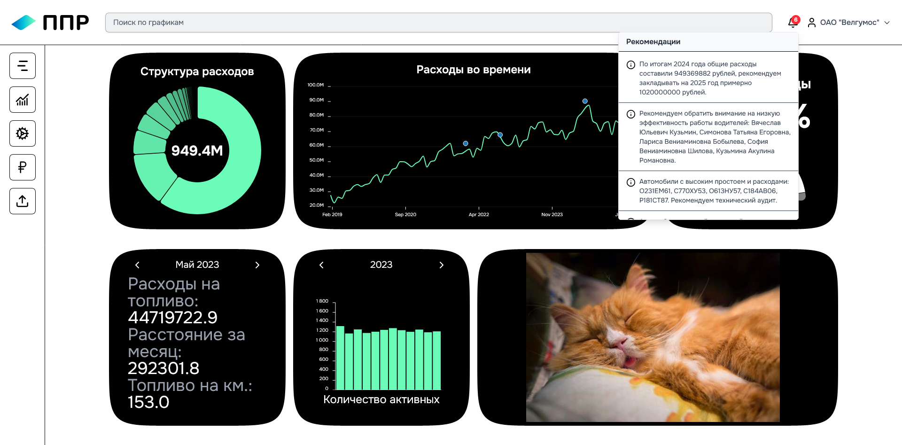

# colorotix


*SvelteKit masterpiece.*<br>
try it [here](https://эврика.великосс.рф) (demo account: gol@gol.gol:golgolgol)

## .env

.env template

```
DATABASE_URL="postgresql://"
JWT_SECRET=""

SSH_HOST=
SSH_PORT=
SSH_USER=
SSH_PASS=
SSH_DIR=

AIRFLOW_HOST=
AIRFLOW_USER=
AIRFLOW_PASSWORD=
```
